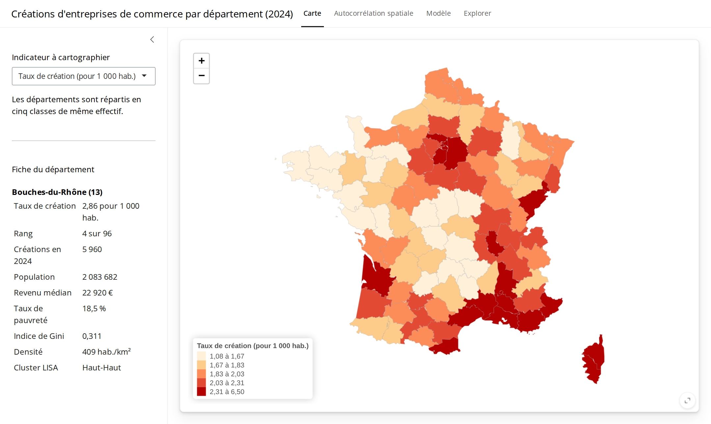
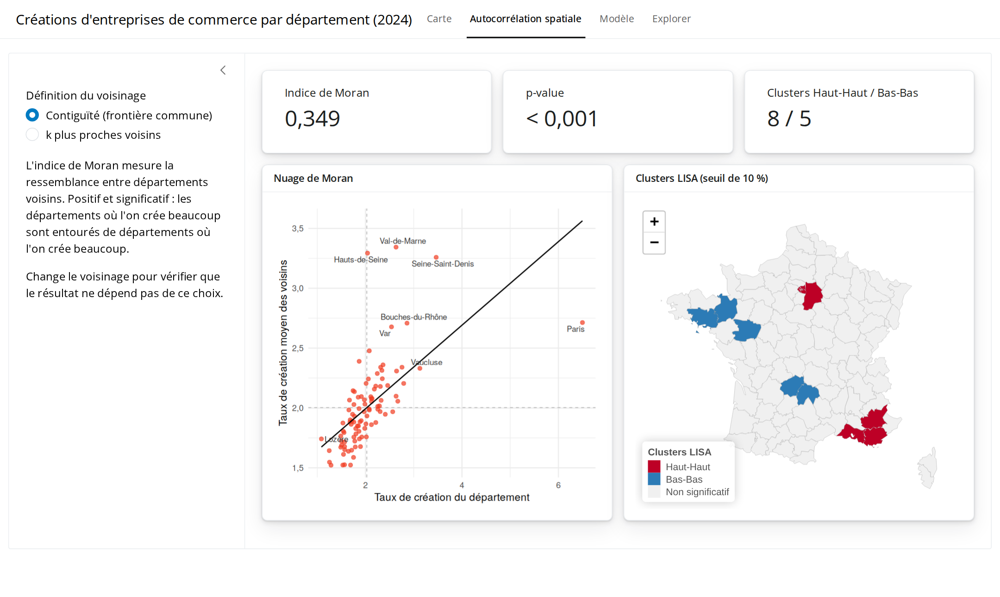
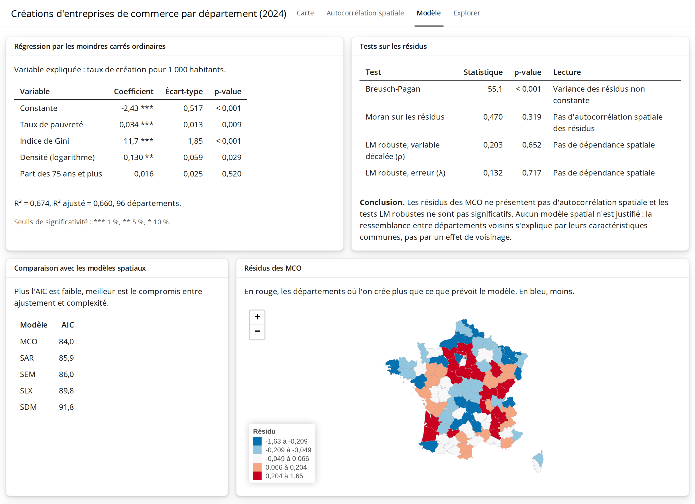

# Créations d'entreprises de commerce par département : une analyse spatiale

Pourquoi crée-t-on plus d'entreprises de commerce dans certains départements que dans d'autres, et ces écarts suivent-ils une logique géographique ?

Ce projet étudie le nombre de créations d'entreprises de commerce pour 1 000 habitants dans les 96 départements de France métropolitaine en 2024, à partir de données publiques de l'Insee. Il enchaîne une analyse exploratoire spatiale, des modèles d'économétrie spatiale et une régression géographiquement pondérée (GWR).

Le dépôt contient le rapport, le code R et une application Shiny pour explorer les résultats.

Projet réalisé à l'ENSAI dans le cadre du cours d'économétrie spatiale, avec Baptiste Pretet et Askhab Tavsiev.

## Aperçu de l'application







## Résultats

**1. Les créations ne sont pas réparties au hasard.** L'indice de Moran vaut 0,35 (p \< 0,001) : un département où l'on crée beaucoup est en général entouré de départements où l'on crée beaucoup. Les clusters LISA font ressortir deux pôles de forte création, l'Île-de-France et le littoral provençal, et deux zones de faible création, dans l'Ouest (Ille-et-Vilaine, Morbihan, Maine-et-Loire) et dans le Massif central (Cantal, Corrèze). Ce résultat tient quand on change la définition du voisinage.

**2. Quatre variables expliquent les deux tiers des écarts.** La régression par les moindres carrés ordinaires atteint un R² de 0,67.

| Variable                           | Coefficient |  p-value |
|------------------------------------|------------:|---------:|
| Indice de Gini                     |        11,7 | \< 0,001 |
| Taux de pauvreté                   |       0,034 |    0,009 |
| Densité de population (logarithme) |       0,130 |    0,029 |
| Part des 75 ans et plus            |       0,016 |    0,520 |

Les départements les plus inégalitaires et les plus denses, c'est-à-dire les grands départements urbains, sont ceux où l'on crée le plus.

**3. Aucun modèle spatial n'est justifié.** Une fois ces variables prises en compte, les résidus ne présentent plus d'autocorrélation spatiale (test de Moran, p = 0,32) et les tests LM robustes ne sont pas significatifs (p = 0,65 et p = 0,72). Les modèles SAR, SEM, SDM et SLX ont tous un AIC plus élevé que les moindres carrés ordinaires. La ressemblance entre départements voisins vient de leurs caractéristiques communes, pas d'un effet d'entraînement entre voisins.

**4. Les effets ne sont pas les mêmes partout.** La GWR améliore légèrement l'ajustement (R² de 0,71) et montre que l'effet du Gini varie de 6,7 à 15,0 selon les départements, avec un maximum dans le Nord-Ouest. L'effet de la part des 75 ans et plus change de signe d'une région à l'autre, ce qui explique qu'il ne ressorte pas au niveau national.

**5. Un modèle estimé sur le Nord prédit moins bien le Sud.** Estimé sur la moitié nord et appliqué à la moitié sud, le modèle obtient un R² de 0,54 et une erreur quadratique moyenne de 0,31, contre un R² de 0,67 sur l'ensemble.

## Limites

- **Découpage géographique.** Les résultats valent à l'échelle du département. À celle de la commune ou de l'intercommunalité, ils pourraient différer.
- **Indicateur.** On compte des créations, pas des entreprises qui durent. L'indicateur ne dit rien de la solidité du tissu commercial.
- **Décalage de dates.** Les créations sont de 2024, les revenus et la pauvreté de 2021.
- **Hétéroscédasticité.** Le test de Breusch-Pagan rejette l'hypothèse d'une variance constante des résidus. Les écarts-types des moindres carrés ordinaires sont donc à lire avec prudence.
- **Corrélation et causalité.** Les liens mis en évidence ne prouvent pas un effet causal. D'autres facteurs non mesurés, comme le tourisme ou la fiscalité locale, jouent sans doute un rôle.

## Données

Toutes les données sont publiques et figurent dans `data/raw/`.

| Fichier | Contenu | Source |
|----|----|----|
| `Creation_Entreprise.xlsx` | Créations d'entreprises par département et secteur, 2012 à 2024 | Insee, démographie des entreprises |
| `Population.xlsx` | Population par département et tranche d'âge, 2024 | Insee, estimations de population |
| `DISP_DEP.csv` | Revenu médian et indice de Gini, 2021 | Insee, Filosofi |
| `FILO2021_DISP_PAUVRES_DEP.csv` | Taux de pauvreté, 2021 | Insee, Filosofi |
| `departements.geojson` | Contours simplifiés des départements | [gregoiredavid/france-geojson](https://github.com/gregoiredavid/france-geojson) |

## Structure du dépôt

```         
statistique-spatiale/
├── data/
│   ├── raw/                  # fichiers Insee et fond de carte
│   └── processed/            # résultats lus par l'application
├── R/
│   ├── preparation.R         # construction de la base et de la carte
│   ├── analyse.R             # poids spatiaux, clusters LISA, GWR
│   └── resultats.R           # calcule et enregistre les résultats
├── rapport/
│   ├── rapport.Rmd           # rapport complet
│   └── rapport.pdf
├── app.R                     # application Shiny
└── renv.lock                 # versions des paquets
```

## Reproduire l'analyse

``` r
# 1. Installer les paquets dans les versions du projet
renv::restore()

# 2. Recalculer les résultats
source("R/resultats.R")

# 3. Lancer l'application
shiny::runApp()
```

Le rapport se compile en ouvrant `rapport/rapport.Rmd` dans RStudio, puis en cliquant sur Knit.

## Outils

R, sf, spdep, spatialreg, GWmodel, tmap, ggplot2, Shiny, leaflet, renv.
